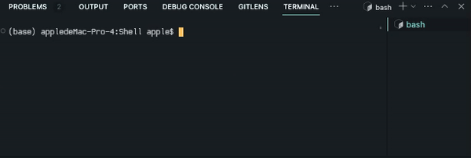

# This program is a mini shell progress, only contain following functions:  

cd : select file  
help: list all function in this shell 
exit: exit shell  

Example:  

### Credit
[Shell in C](https://brennan.io/2015/01/16/write-a-shell-in-c/)